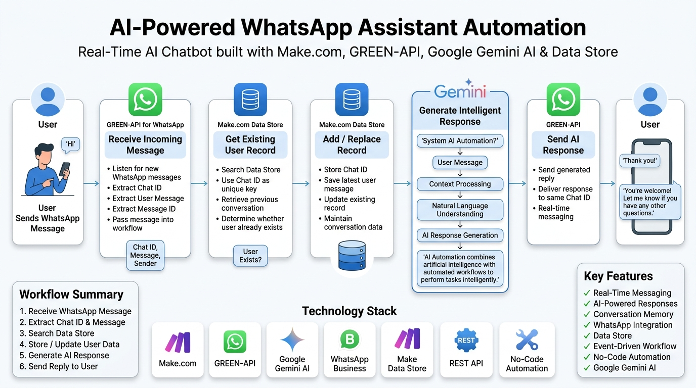
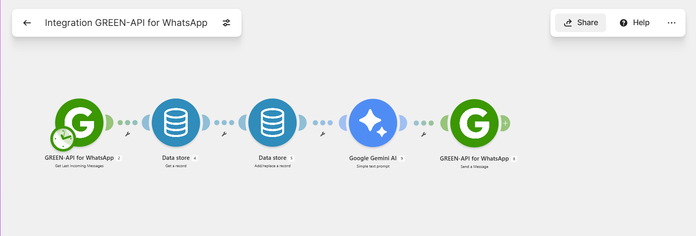
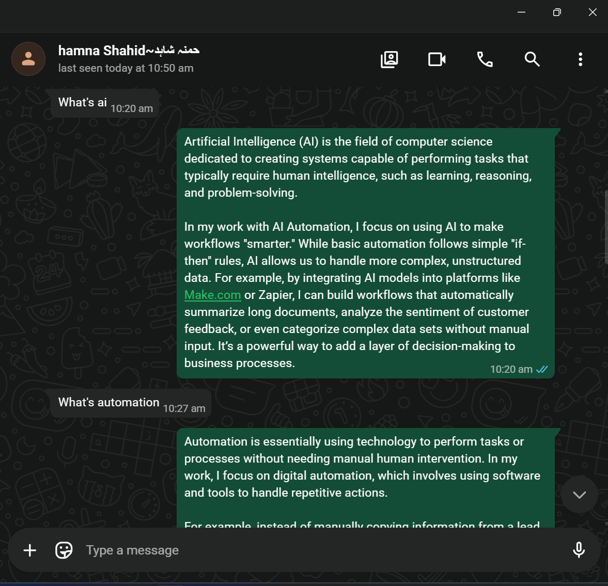
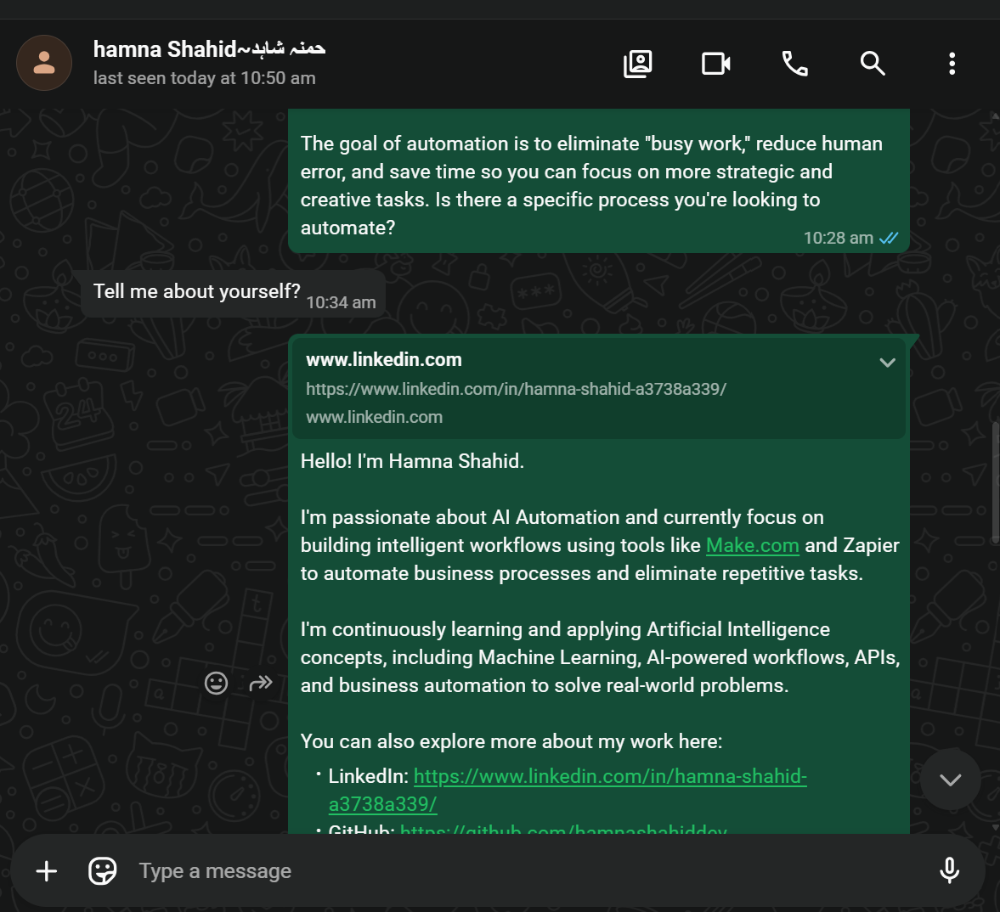

# 🤖 WhatsApp AI Assistant Automation

> **Built With:** GREEN-API for WhatsApp • Google Gemini AI • Make.com • Data Store • No-Code Automation

An AI-powered WhatsApp Assistant built entirely with **Make.com** that automatically receives incoming WhatsApp messages, stores user conversation data, generates intelligent responses using **Google Gemini AI**, and replies instantly through WhatsApp. The entire workflow operates in real time without writing custom backend code.

---

# ❗ Problem Statement

Providing instant support on WhatsApp often requires someone to continuously monitor incoming messages and manually respond to users. As conversations grow, this becomes repetitive, time-consuming, and difficult to scale.

Businesses and professionals need a way to automatically respond to inquiries while maintaining conversation history while delivering fast, intelligent responses.

---

# ✅ Solution

This project automates the complete WhatsApp conversation workflow.

Whenever a user sends a WhatsApp message, **Make.com** immediately receives the message through **GREEN-API**, retrieves the user's previous conversation record from a **Data Store**, updates the conversation history, sends the user's message to **Google Gemini AI**, and automatically delivers the generated response back to the same WhatsApp chat.

Everything happens automatically in real time.

---

# 🔎 Overview

Whenever a user sends a WhatsApp message, the automation performs the following steps:

### 1️⃣ Receive Incoming Message

**GREEN-API** listens for new WhatsApp messages and extracts:

- Chat ID
- User Message
- Message ID
- Sender Information

---

### 2️⃣ Check Existing User

The workflow searches the **Make.com Data Store** using the Chat ID.

- If the user already exists, the previous record is retrieved.
- If the user is new, the workflow prepares to create a new record.

---

### 3️⃣ Store Conversation

The latest conversation information is stored inside the **Data Store**.

The automation updates:

- Chat ID
- Latest Message
- User Information

This keeps conversation data organized for future interactions.

---

### 4️⃣ Generate AI Response

Google Gemini AI receives:

- System Prompt
- User Message

Gemini generates a professional, natural, and context-aware reply.

---

### 5️⃣ Send WhatsApp Reply

GREEN-API automatically sends the generated response back to the same WhatsApp conversation.

The user receives the reply within seconds.

---

# 🏗️ Architecture

```text
User
   │
   ▼
GREEN-API
   │
   ▼
Data Store (Get Record)
   │
   ▼
Data Store (Add / Update)
   │
   ▼
Google Gemini AI
   │
   ▼
GREEN-API
   │
   ▼
WhatsApp User
```

---

# 🖇️ Workflow Diagram



---

# ⚙️ Make.com Scenario



---

# 📸 Project Screenshots

## WhatsApp Conversation Demo

User sends a greeting and receives an AI-generated response.



---

## AI Conversation Example

Shows another conversation handled automatically.



---

# ✨ Features

- 🚀 Real-time WhatsApp message automation
- 🤖 AI-powered responses using Google Gemini AI
- 💬 Automatic incoming message detection
- 🗂️ Conversation history management
- 💾 Stores user information in Make Data Store
- ⚡ Instant WhatsApp replies
- 🔄 Fully automated workflow
- 🛠️ No-code automation built with Make.com
- 🧠 Professional Gemini AI system prompt
- 🎯 Easily customizable AI behavior
- 📈 Scalable architecture
- 💼 Portfolio-ready implementation

---

# 🛠️ Technologies Used

| Service | Purpose |
|---------|---------|
| GREEN-API for WhatsApp | Receive and send WhatsApp messages |
| Google Gemini AI | Generate intelligent responses |
| Make Data Store | Store user conversation data |
| Make.com | Workflow automation platform |
| Gemini System Prompt | Defines AI assistant behavior |

---

# 🔄 Workflow

```text
User sends WhatsApp message
            │
            ▼
Receive incoming message
            │
            ▼
Search existing user
            │
            ▼
Update conversation record
            │
            ▼
Generate AI response
            │
            ▼
Send WhatsApp reply
            │
            ▼
Conversation completed
```

---

# 📂 Repository Structure

```text
WHATSAPP-AI-ASSISTANT-AUTOMATION/
│
├── blueprint/
│   └── Integration GREEN-API for WhatsApp.blueprint.json
│
├── docs/
│   ├── whatsapp-chat-demo-1.png
│   └── whatsapp-chat-demo-2.png
│
├── .gitignore
├── gemini-system-prompt.md
├── LICENSE
├── README.md
├── scenario-diagram.png
└── workflow-diagram.png
```

---

# 🧠 AI Prompt

The project includes a separate Gemini system prompt for easy customization.

```text
gemini-system-prompt.md
```

The prompt controls:

- Assistant personality
- Response style
- Supported topics
- Conversation behavior
- Professional tone
- AI instructions

---

# ⚙️ Setup Guide

## 📋 Prerequisites

Before running this project, make sure you have:

- A Make.com account
- A GREEN-API account
- A WhatsApp account connected to GREEN-API
- A Google Gemini API Key
- A Make Data Store

---

## 🚀 Installation

1. Clone this repository.
2. Import the Blueprint into Make.com.
3. Create a GREEN-API instance.
4. Connect GREEN-API in Make.com.
5. Create a Data Store.
6. Connect Google Gemini AI.
7. Copy the system prompt from `gemini-system-prompt.md`.
8. Turn on the scenario.

Your AI-powered WhatsApp Assistant is now ready to respond to incoming messages automatically.

---

# 📌 Notes

- User conversations are **not stored** in this repository.
- API keys and credentials are excluded for security.
- Connect your own GREEN-API and Gemini AI accounts before running the workflow.
- This project is intended for educational, portfolio, and automation learning purposes.

---

# 🚀 Future Improvements

- 🧠 Long-term conversation memory using databases
- 🎤 Voice message support
- 🖼️ Image understanding with Gemini Vision
- 📄 PDF question answering
- 🌍 Multi-language conversations
- 📎 WhatsApp document support
- 🧑‍💼 Lead qualification workflows
- 🗃️ CRM integration
- 📊 Google Sheets conversation logging
- 📧 Email notifications
- 🤖 OpenAI model support
- 🔀 Multi-agent architecture

---

# 📜 License

This project is licensed under the **MIT License**.

---

# 👩‍💻 Author

**Hamna Shahid**  
**AI Automation Engineer**

- 💼 **LinkedIn:** https://www.linkedin.com/in/hamna-shahid-a3738a339/
- 💻 **GitHub:** https://github.com/hamnashahiddev

---

⭐ **If you found this project useful, consider giving it a star on GitHub!**